# MySQL-从入门到入土

## 前言

从0开始学SQL

参考文献:

超详细MySQL安装及基本使用教程

    https://blog.csdn.net/theLostLamb/article/details/78797643

MySQL 有这一篇就够:

    https://blog.csdn.net/weixin_45851945/article/details/114287877?ops_request_misc=%257B%2522request%255Fid%2522%253A%2522171339957616800222844656%2522%252C%2522scm%2522%253A%252220140713.130102334..%2522%257D&request_id=171339957616800222844656&biz_id=0&utm_medium=distribute.pc_search_result.none-task-blog-2~all~top_positive~default-2-114287877-null-null.142^v100^pc_search_result_base5&utm_term=mysql&spm=1018.2226.3001.4187

MySQL入门篇:

    https://blog.csdn.net/qq_40492693/article/details/124894470

MySQL Binlog（主从同步/数据恢复） 及 mysqldump

    https://blog.csdn.net/qq_37102984/article/details/117842450

## 一. mysql环境安装

### 1. 如果你的Mac上还没有安装MySQL，你可以通过Homebrew来安装。

#### 1. 首先，打开终端并输入以下命令来安装Homebrew：

    /bin/bash -c "$(curl -fsSL https://raw.githubusercontent.com/Homebrew/install/HEAD/install.sh)"

#### 2. 添加Homebrew到 PATH 环境变量中

     echo 'set -g fish_user_paths /opt/homebrew/bin $fish_user_paths' >> ~/.config/fish/config.fish

#### 3. 重新加载 shell 配置,运行以下命令

    source ~/.config/fish/config.fish

#### 4. 安装完成后，你可以使用以下命令来安装MySQL：

    brew install mysql

### 2. 启动MySQL

#### 1. 安装完成后，你需要启动MySQL服务。 你可以使用以下命令来启动MySQL：

    brew services start mysql

#### 2. 如果你想要在Mac启动时自动启动MySQL服务，你可以使用以下命令：

    brew services run mysql

#### 3. 验证MySQL安装

你可以使用以下命令来检查MySQL是否已经成功安装并正在运行：

    mysql -v

#### 4. 连接MySQL数据库

    mysql -u root -p

#### 5. 如果你已经安装了MySQL，但是系统找不到mysql命令，那么可能是因为MySQL的路径没有被添加到PATH环境变量。

你可以通过编辑你的shell配置文件（如.bashrc或.zshrc）来添加路径。

例如，如果你的MySQL安装在/usr/local/mysql/bin，你可以添加以下行到你的配置文件：

    export PATH=$PATH:/usr/local/mysql/bin

运行

    source ~/.bashrc

或

    source ~/.zshrc

来应用新的环境变量设置。

**现在，你应该能够运行mysql命令了。**

## 二.数据库、数据表的基本操作

### 1. 数据库的基本操作

#### 1. MySQL安装完成后，要想将数据存储到数据库的表中，首先要创建一个数据库

    create database 数据库名称;

运行效果展示：

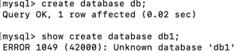

#### 2. 创建数据库后查看该数据库基本信息MySQL命令

    show create database 数据库名称;

运行效果展示：

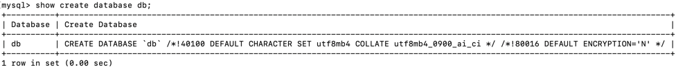

#### 3. 删除数据库MySQL命令：

    drop database 数据库名称;

运行效果展示：

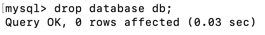

#### 4. 查询出MySQL中所有的数据库MySQL命令

    show databases;

运行效果展示：

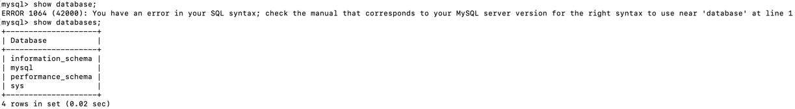

#### 5. 将数据库的字符集修改为gbk MySQL命令

    alter database 数据库名称 character set gbk;

运行效果展示：

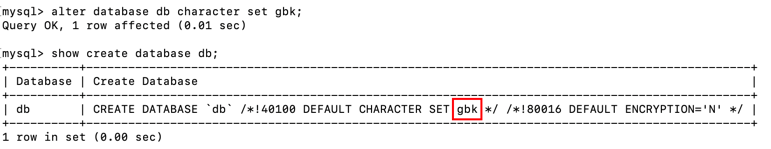

#### 6. 切换数据库 MySQL命令

    use 数据库名称;

运行效果展示：

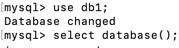

#### 7. 查看当前使用的数据库 MySQL命令：

    select database();

运行效果展示：

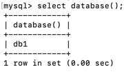

### 2. 数据表的操作

**数据库创建成功后可在该数据库中创建数据表(简称为表)存储数据。**

**请注意：在操作数据表之前应使用“USE 数据库名;”
指定操作是在哪个数据库中进行先关操作，
否则会抛出“No database selected”错误。**

#### 1. 创建数据表

    create table 表名(
    字段1 字段类型,
    字段2 字段类型,
    …
    字段n 字段类型);

运行效果展示：

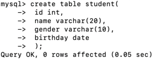

#### 2. 查看数据表

    show tables;

运行效果展示：

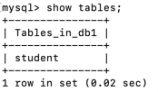

##### (1) 查表的基本信息 MySQL命令

    show create table 表名;

运行效果展示:

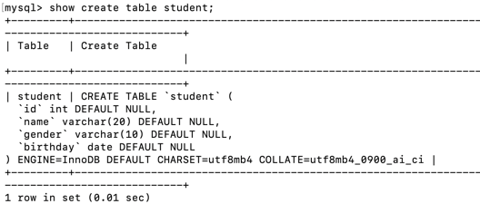

##### (2) 查看表的字段信息 MySQL命令

    desc 表名;

运行效果展示:

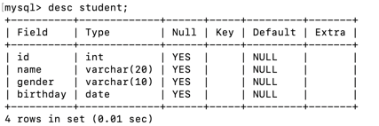

#### 3. 修改数据表

##### 3.1 修改表名 MySQL命令

    修改表名 MySQL命令

运行效果展示:

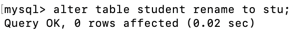

##### 3.2 修改字段名 MySQL命令

    alter table stu change name sname varchar(10);

运行效果展示:

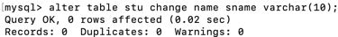

##### 3.3 修改字段数据类型 MySQL命令

    alter table stu modify sname int;

运行效果展示:

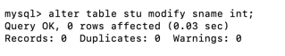

##### 3.4 增加字段 MySQL命令

    alter table stu add address varchar(50);

运行效果展示:

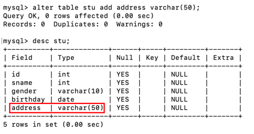

##### 3.5 删除字段 MySQL命令

    alter table stu drop address;

运行效果展示:

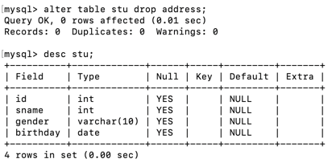

#### 4. 删除数据表

##### 4.1 删除数据表 MySQL命令

    drop table 表名;

运行效果展示:

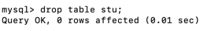

## 三. 数据表的约束

### 1. 主键约束

主键约束即primary key用于唯一的标识表中的每一行。

被标识为主键的数据在表中是唯一的且其值不能为空。这点类似于我们每个人都有一个身份证号，并且这个身份证号是唯一的。

**主键约束基本语法：**

    字段名 数据类型 primary key;

#### 1.1 设置主键约束(primary key)的第一种方式

    create table student(
    id int primary key,
    name varchar(20));

运行效果展示:

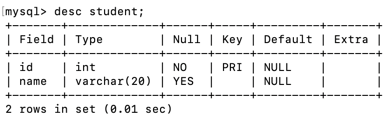

#### 1.2 设置主键约束(primary key)的第二·种方式

    create table student01(
    id int,
    name varchar(20),
    primary key(id));

运行效果展示:

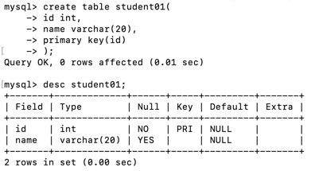

### 2. 非空约束

非空约束即 NOT NULL指的是字段的值不能为空，基本的语法格式如下所示：

    字段名 数据类型 NOT NULL;

示例：MySQL命令：

    create table student02(
    id int,
    name varchar(20) not null);

运行效果展示:

### 3. 默认值约束

默认值约束即DEFAULT用于给数据表中的字段指定默认值，即当在表中插入一条新记录时若未给该字段赋值，那么数据库系统会自动为这个字段插入默认值；其基本的语法格式如下所示：

    字段名 数据类型 DEFAULT 默认值；

示例：MySQL命令：

    create table student03(
    id int,
    name varchar(20),
    gender varchar(10) default 'male');

运行效果展示:

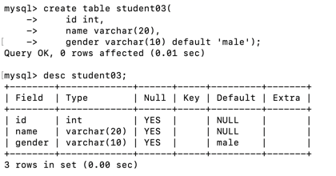

### 4. 唯一性约束

唯一性约束即UNIQUE用于保证数据表中字段的唯一性，即表中字段的值不能重复出现，其基本的语法格式如下所示：

    字段名 数据类型 UNIQUE;

示例：MySQL命令：

    create table student04(
    id int,
    name varchar(20) unique);

运行效果展示:

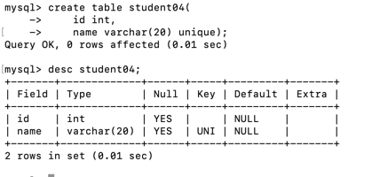

### 5. 外键约束

外键约束即FOREIGN KEY常用于多张表之间的约束。基本语法如下：

    -- 在创建数据表时语法如下：
    CONSTRAINT 外键名 FOREIGN KEY (从表外键字段) REFERENCES 主表 (主键字段)

---

    -- 将创建数据表创号后语法如下：
    ALTER TABLE 从表名 ADD CONSTRAINT 外键名 FOREIGN KEY (从表外键字段) REFERENCES 主表 (主键字段);

示例：创建一个学生表 MySQL命令：

    create table student05(
    id int primary key,
    name varchar(20));

示例：创建一个班级表 MySQL命令：

    create table class(
    classid int primary key,
    studentid int);

示例：学生表作为主表，班级表作为副表设置外键， MySQL命令：

    alter table class add constraint fk_class_studentid foreign key(studentid) references student05(id);

运行效果展示:

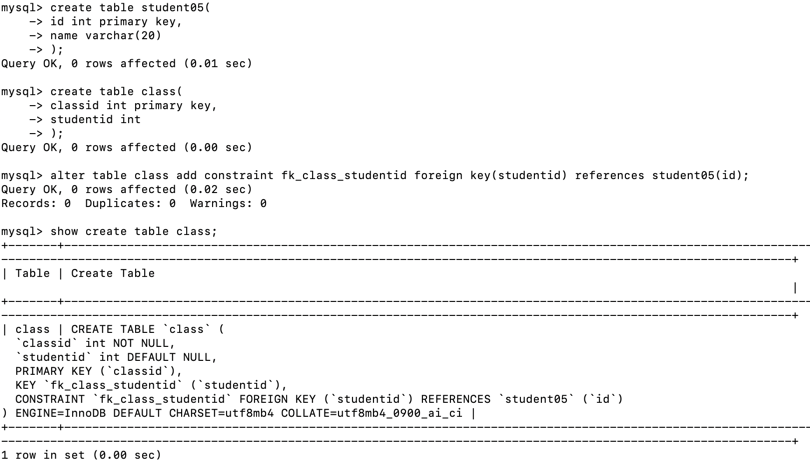

#### 5.1 数据一致性概念

大家知道：建立外键是为了保证数据的完整和统一性。

但是，如果主表中的数据被删除或修改从表中对应的数据该怎么办呢？

很明显，从表中对应的数据也应该被删除，否则数据库中会存在很多无意义的垃圾数据。

#### 5.2 删除外键

语法如下：

    alter table 从表名 drop foreign key 外键名；

示例：删除外键 MySQL命令：

    alter table class drop foreign key fk_class_studentid;

运行效果展示:

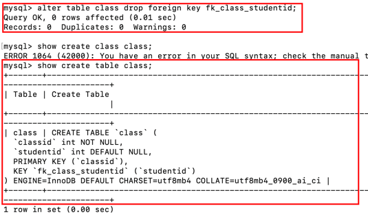
¬
**外键的那个字段不在了证明删除成功了**

#### 5.3 关于外键约束需要注意的细节

**1.从表里的外键通常为主表的主键**

**2.从表里外键的数据类型必须与主表中主键的数据类型一致**

**3.主表发生变化时应注意主表与从表的数据一致性问题**

## 四. 数据表插入数据

**在MySQL通过INSERT语句向数据表中插入数据。在此，我们先准备一张学生表，代码如下：**

    create table student(
    id int,
    name varchar(30),
    age int,
    gender varchar(30));

### 1. 为表中所有字段插入数据

**每个字段与其值是严格一一对应的。**

**也就是说：每个值、值的顺序、值的类型必须与对应的字段相匹配。**

**但是，各字段也无须与其在表中定义的顺序一致，它们只要与 VALUES中值的顺序一致即可。**

语法如下：

    INSERT INTO 表名（字段名1,字段名2,...) VALUES (值 1,值 2,...);

示例：向学生表中插入一条学生信息 MySQL命令：

    insert into student (id,name,age,gender) values (1,'bob',16,'male');

运行效果展示:

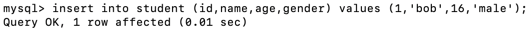

### 2. 为表中指定字段插入数据

语法如下：

    INSERT INTO 表名（字段名1,字段名2,...) VALUES (值 1,值 2,...);

插入数据的方法基本和为表中所有字段插入数据，一样，只是需要插入的字段由你自己指定

### 3. 同时插入多条记录

语法如下：

    INSERT INTO 表名 [(字段名1,字段名2,...)]VALUES (值 1,值 2,…),(值 1,值 2,…),...;

在该方式中：(字段名1,字段名2,…)是可选的，它用于指定插入的字段名；(值 1,值 2,…),(值 1,值 2,…)表示要插入的记录，该记录可有多条并且每条记录之间用逗号隔开。

示例：向学生表中插入多条学生信息 MySQL命令：

    insert into student (id,name,age,gender) values (2,'lucy',17,'female'),(3,'jack',19,'male'),(4,'tom',18,'male');

运行效果展示:

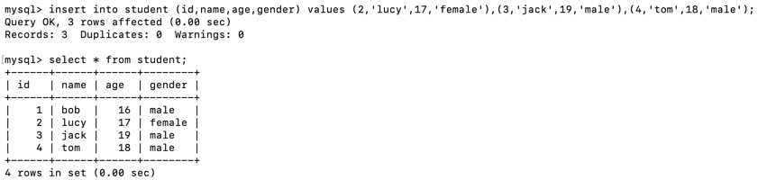

## 五. 更新数据

**在MySQL通过UPDATE语句更新数据表中的数据。在此，我们将就用六中的student学生表**

### 1. UPDATE基本语法

    UPDATE 表名 SET 字段名1=值1[,字段名2 =值2,…] [WHERE 条件表达式];

在该语法中：字段名1、字段名2…用于指定要更新的字段名称；值1、值 2…用于表示字段的新数据；WHERE 条件表达式 是可选的，它用于指定更新数据需要满足的条件

### 2. UPDATE更新部分数据

示例：将name为tom的记录的age设置为20并将其gender设置为female MySQL命令：

    update student set age=20,gender='female' where name='tom';

运行效果展示:

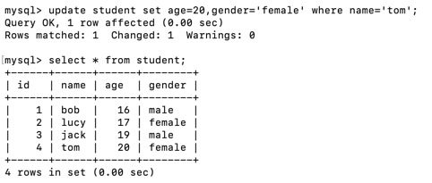

### 3. UPDATE更新全部数据

示例：将所有记录的age设置为18 MySQL命令：

    update student set age=18;

运行效果展示:

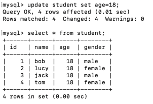

## 六. 删除数据

**在MySQL通过DELETE语句删除数据表中的数据。在此，我们先准备一张数据表，代码如下：**

    -- 创建学生表
    create table student(
    id int,
    name varchar(30),
    age int,
    gender varchar(30)
    );

---

    -- 插入数据
    insert into student (id,name,age,gender) values (2,'lucy',17,'female'),(3,'jack',19,'male'),(4,'tom',18,'male'),(5,'sal',19,'female'),(6,'sun',20,'male')
    ,(7,'sad',13,'female'),(8,'sam',14,'male');

### 1. DELETE基本语法

在该语法中：表名用于指定要执行删除操作的表；[WHERE 条件表达式]为可选参数用于指定删除的条件。

    DELETE FROM 表名 [WHERE 条件表达式];

### 2. DELETE删除部分数据

示例：删除age等于14的所有记录 MySQL命令：

    delete from student where age=14;

运行效果展示:

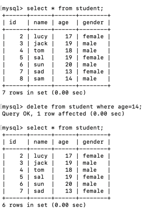

### 3. DELETE删除全部数据

示例：删除student表中的所有记录 MySQL命令：

    delete from student;

运行效果展示:

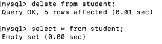

### 4. TRUNCATE和DELETE的区别

TRUNCATE和DETELE都能实现删除表中的所有数据的功能，但两者也是有区别的：

1、DELETE语句后可跟WHERE子句，可通过指定WHERE子句中的条件表达式只删除满足条件的部分记录；但是，TRUNCATE语句只能用于删除表中的所有记录。

2、使用TRUNCATE语句删除表中的数据后，再次向表中添加记录时自动增加字段的默认初始值重新由1开始；

使用DELETE语句删除表中所有记录后，再次向表中添加记录时自动增加字段的值为删除时该字段的最大值加1

3、DELETE语句是DML语句，TRUNCATE语句通常被认为是DDL语句

## 七. MySQL数据表简单查询

### 1. 简单查询概述

**简单查询即不含where的select语句。在此，我们讲解简单查询中最常用的两种查询：查询所有字段和查询指定字段。
在此，先准备测试数据，代码如下：**

    -- 创建数据库
    DROP DATABASE IF EXISTS mydb;
    CREATE DATABASE mydb;
    USE mydb;

---

    -- 创建student表
    CREATE TABLE stu (
    sid CHAR(6),
    sname VARCHAR(50),
    age INT,
    gender VARCHAR(50) DEFAULT 'male'
    );

---

    -- 向student表插入数据
    INSERT INTO stu (sid,sname,age,gender) VALUES ('S_1001', 'lili', 14, 'male');
    INSERT INTO stu (sid,sname,age,gender) VALUES ('S_1002', 'wang', 15, 'female');
    INSERT INTO stu (sid,sname,age,gender) VALUES ('S_1003', 'tywd', 16, 'male');
    INSERT INTO stu (sid,sname,age,gender) VALUES ('S_1004', 'hfgs', 17, 'female');
    INSERT INTO stu (sid,sname,age,gender) VALUES ('S_1005', 'qwer', 18, 'male');
    INSERT INTO stu (sid,sname,age,gender) VALUES ('S_1006', 'zxsd', 19, 'female');
    INSERT INTO stu (sid,sname,age,gender) VALUES ('S_1007', 'hjop', 16, 'male');
    INSERT INTO stu (sid,sname,age,gender) VALUES ('S_1008', 'tyop', 15, 'female');
    INSERT INTO stu (sid,sname,age,gender) VALUES ('S_1009', 'nhmk', 13, 'male');
    INSERT INTO stu (sid,sname,age,gender) VALUES ('S_1010', 'xdfv', 17, 'female');

### 2. 查询所有字段(方法不唯一 只是举例)

查询所有字段 MySQL命令：

    select * from student;

运行效果展示:

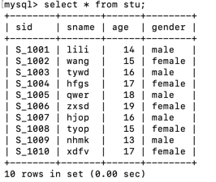

### 3. 查询指定字段(sid,sname)

查询指定字段（sid、sname） MySQL命令：

    select sid,sname from student;

运行效果展示:

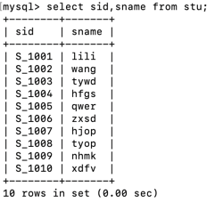

### 4. 常数的查询

**在SELECT中除了书写列名，还可以书写常数。可以用于标记**

常数的查询日期标记 MySQL命令：

    select sid,sname,'2021-03-02' from stu;

运行效果展示:

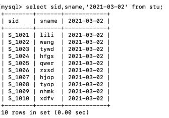

### 5. 从查询结果中过滤重复数据

在使用DISTINCT 时需要注意：

**在SELECT查询语句中DISTINCT关键字只能用在第一个所查列名之前。**

    select distinct gender from stu;

运行效果展示:

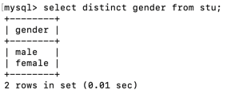

### 6. 算数运算符(举例加运算符)

**在SELECT查询语句中还可以使用加减乘除运算符。**

查询学生10年后的年龄 MySQL命令：

    select sname,age+10 from stu;

运行效果展示:

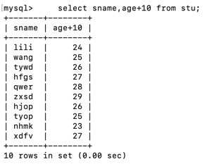

## 八. 函数

在此，先准备测试数据，代码如下：

    -- 创建数据库
    DROP DATABASE IF EXISTS mydb;
    CREATE DATABASE mydb;
    USE mydb;

---

    -- 创建student表
    CREATE TABLE student (
    sid CHAR(6),
    sname VARCHAR(50),
    age INT,
    gender VARCHAR(50) DEFAULT 'male'
    );

---

    -- 向student表插入数据
    INSERT INTO student (sid,sname,age,gender) VALUES ('S_1001', 'lili', 14, 'male');
    INSERT INTO student (sid,sname,age,gender) VALUES ('S_1002', 'wang', 15, 'female');
    INSERT INTO student (sid,sname,age,gender) VALUES ('S_1003', 'tywd', 16, 'male');
    INSERT INTO student (sid,sname,age,gender) VALUES ('S_1004', 'hfgs', 17, 'female');
    INSERT INTO student (sid,sname,age,gender) VALUES ('S_1005', 'qwer', 18, 'male');
    INSERT INTO student (sid,sname,age,gender) VALUES ('S_1006', 'zxsd', 19, 'female');
    INSERT INTO student (sid,sname,age,gender) VALUES ('S_1007', 'hjop', 16, 'male');
    INSERT INTO student (sid,sname,age,gender) VALUES ('S_1008', 'tyop', 15, 'female');
    INSERT INTO student (sid,sname,age,gender) VALUES ('S_1009', 'nhmk', 13, 'male');
    INSERT INTO student (sid,sname,age,gender) VALUES ('S_1010', 'xdfv', 17, 'female');

### 1. 聚合函数

在开发中，我们常常有类似的需求：统计某个字段的最大值、最小值、 平均值等等。

为此，MySQL中提供了聚合函数来实现这些功能。所谓聚合，就是将多行汇总成一行；

其实，所有的聚合函数均如此——输入多行，输出一行。

聚合函数具有自动滤空的功能，若某一个值为NULL，那么会自动将其过滤使其不参与运算。

**聚合函数使用规则：**

只有SELECT子句和HAVING子句、ORDER BY子句中能够使用聚合函数。

例如，在WHERE子句中使用聚合函数是错误的。

#### 1.1 count()

统计表中数据的行数或者统计指定列其值不为NULL的数据个数

查询有多少该表中有多少人

MySQL命令：

    select count(*) from student;

运行效果展示:

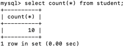

#### 1.2 max()

计算指定列的最大值，如果指定列是字符串类型则使用字符串排序运算

查询该学生表中年纪最大的学生

MySQL命令：

    select max(age) from student;

运行效果展示:

#### 1.3 min()

计算指定列的最小值，如果指定列是字符串类型则使用字符串排序运算

查询该学生表中年纪最小的学生 MySQL命令：

    select sname,min(age) from student group by sname;

运行效果展示:

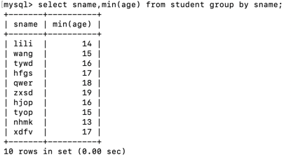

#### 1.4 sum()

计算指定列的数值和，如果指定列类型不是数值类型则计算结果为0

查询该学生表中年纪的总和 MySQL命令：

    select sum(age) from student;

运行效果展示:

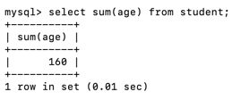

#### 1.5 avg()

计算指定列的平均值，如果指定列类型不是数值类型则计算结果为

查询该学生表中年纪的平均数 MySQL命令：

    select avg(age) from student;

运行效果展示:

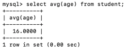

### 2. 其他常用函数

#### 2.1 时间函数

    1  | SELECT NOW();
    2  | SELECT DAY (NOW());
    3  | SELECT DATE (NOW());
    4  | SELECT TIME (NOW());
    5  | SELECT YEAR (NOW());
    6  | SELECT MONTH (NOW());
    7  | SELECT CURRENT_DATE();
    8  | SELECT CURRENT_TIME();
    9  | SELECT CURRENT_TIMESTAMP();
    10 | SELECT ADDTIME('14:23:12','01:02:01');
    11 | SELECT DATE_ADD(NOW(),INTERVAL 1 DAY);
    12 | SELECT DATE_ADD(NOW(),INTERVAL 1 MONTH);
    13 | SELECT DATE_SUB(NOW(),INTERVAL 1 DAY);
    14 | SELECT DATE_SUB(NOW(),INTERVAL 1 MONTH);
    15 | SELECT DATEDIFF('2019-07-22','2019-05-05');

#### 2.2 字符串函数

    --连接函数
    SELECT CONCAT ()
    --
    SELECT INSTR ();
    --统计长度
    SELECT LENGTH();

#### 2.3 数学函数

    -- 绝对值
    SELECT ABS(-136);
    -- 向下取整
    SELECT FLOOR(3.14);
    -- 向上取整
    SELECT CEILING(3.14);

## 九. 条件查询

数据库中存有大量数据，我们可根据需求获取指定的数据。

此时，我们可在查询语句中通过WHERE子句指定查询条件对查询结果进行过滤。

在开始学习条件查询之前，我们先准备测试数据，代码如下：

    -- 创建数据库
    DROP DATABASE IF EXISTS mydb;
    CREATE DATABASE mydb;
    USE mydb;

---

    -- 创建student表
    CREATE TABLE student (
    sid CHAR(6),
    sname VARCHAR(50),
    age INT,
    gender VARCHAR(50) DEFAULT 'male'
    );

---

    -- 向student表插入数据
    INSERT INTO student (sid,sname,age,gender) VALUES ('S_1001', 'lili', 14, 'male');
    INSERT INTO student (sid,sname,age,gender) VALUES ('S_1002', 'wang', 15, 'female');
    INSERT INTO student (sid,sname,age,gender) VALUES ('S_1003', 'tywd', 16, 'male');
    INSERT INTO student (sid,sname,age,gender) VALUES ('S_1004', 'hfgs', 17, 'female');
    INSERT INTO student (sid,sname,age,gender) VALUES ('S_1005', 'qwer', 18, 'male');
    INSERT INTO student (sid,sname,age,gender) VALUES ('S_1006', 'zxsd', 19, 'female');
    INSERT INTO student (sid,sname,age,gender) VALUES ('S_1007', 'hjop', 16, 'male');
    INSERT INTO student (sid,sname,age,gender) VALUES ('S_1008', 'tyop', 15, 'female');
    INSERT INTO student (sid,sname,age,gender) VALUES ('S_1009', 'nhmk', 13, 'male');
    INSERT INTO student (sid,sname,age,gender) VALUES ('S_1010', 'xdfv', 17, 'female');
    INSERT INTO student (sid,sname,age,gender) VALUES ('S_1012', 'lili', 14, 'male');
    INSERT INTO student (sid,sname,age,gender) VALUES ('S_1013', 'wang', 15, 'female');

### 1. 使用关系运算符查询

    关系运算符	            说明    
    =	                    等于
    <>	                    不等于
    !=	                    不等于
    <	                    小于
    <=	                    小于等于
    >	                    大于
    >=	                    大于等于

查询年龄等于或大于17的学生的信息 MySQL命令：

    select * from student where age>=17;

运行效果展示:

### 2. 使用IN关键字查询

IN关键字用于判断某个字段的值是否在指定集合中。如果字段的值恰好在指定的集合中，则将字段所在的记录将査询出来。

查询sid为S_1002和S_1003的学生信息 MySQL命令：

    select * from student where sid in ('S_1002','S_1003');

运行效果展示:

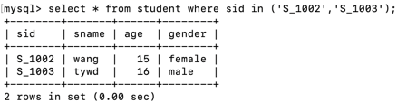

查询sid为S_1001以外的学生的信息 MySQL命令：

    select * from student where sid not in ('S_1001');

运行效果展示:

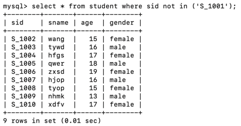

### 3. 使用BETWEEN AND关键字查询

BETWEEN AND用于判断某个字段的值是否在指定的范围之内。

如果字段的值在指定范围内，则将所在的记录将查询出来

查询15到18岁的学生信息 MySQL命令：

    select * from student where age between 15 and 18;

运行效果展示:

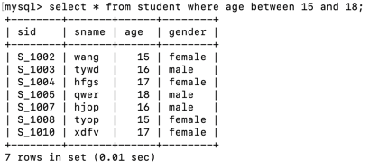

查询不是15到18岁的学生信息 MySQL命令：

    select * from student where age not between 15 and 18;

运行效果展示:

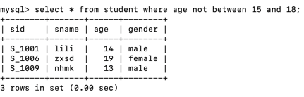

### 4. 使用空值查询

在MySQL中，使用 IS NULL关键字判断字段的值是否为空值。

请注意：空值NULL不同于0，也不同于空字符串

查询sname不为空值的学生信息 MySQL命令：

    select * from student where sname is not null;

运行效果展示:

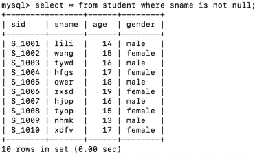

### 5. 使用AND关键字查询

在MySQL中可使用AND关键字可以连接两个或者多个查询条件。

查询年纪大于15且性别为male的学生信息 MySQL命令：

    select * from student where age>15 and gender='male';

运行效果展示:

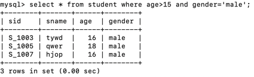

### 6. 使用OR关键字查询

在使用SELECT语句查询数据时可使用OR关键字连接多个査询条件。

在使用OR关键字时，只要记录满足其中任意一个条件就会被查询出来

查询年纪大于15或者性别为male的学生信息 MySQL命令：

    select * from student where age>15 or gender='male';

运行效果展示:

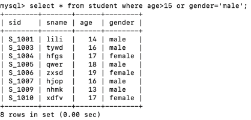

### 7. 使用LIKE关键字查询

**MySQL中可使用LIKE关键字可以判断两个字符串是否相匹配**

#### 7.1 普通字符串

查询sname中与wang匹配的学生信息 MySQL命令：

    select * from student where sname like 'wang';

运行效果展示:

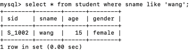

#### 7.2 含有%通配的字符串

%用于匹配任意长度的字符串。例如，字符串“a%”匹配以字符a开始任意长度的字符串

查询学生姓名以li开始的记录 MySQL命令：

    select * from student where sname like 'li%';

运行效果展示:

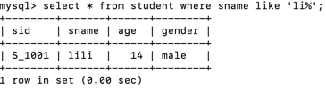

查询学生姓名以g结尾的记录 MySQL命令：

    select * from student where sname like '%g';

运行效果展示:

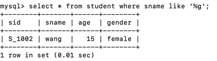

查询学生姓名包含s的记录 MySQL命令：

    select * from student where sname like '%s%';

运行效果展示:

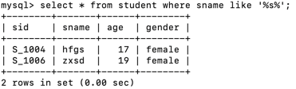

#### 7.3 含有_通配的字符串

下划线通配符只匹配单个字符，如果要匹配多个字符，需要连续使用多个下划线通配符。

例如，字符串“ab_”匹配以字符串“ab”开始长度为3的字符串，如abc、abp等等；

字符串“a__d”匹配在字符“a”和“d”之间包含两个字符的字符串，如"abcd"、"atud"等等。

查询学生姓名以zx开头且长度为4的记录 MySQL命令：

    select * from student where sname like 'zx__';

运行效果展示:

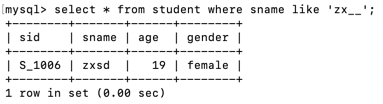

查询学生姓名以g结尾且长度为4的记录 MySQL命令：

    select * from student where sname like '___g';

运行效果展示:

### 8. 使用LIMIT限制查询结果的数量

当执行查询数据时可能会返回很多条记录，而用户需要的数据可能只是其中的一条或者几条

查询学生表中年纪最小的3位同学 MySQL命令：

    select * from student order by age asc limit 3;

运行效果展示:

### 9. 使用GROUP BY进行分组查询

GROUP BY 子句可像切蛋糕一样将表中的数据进行分组，再进行查询等操作。

换言之，可通俗地理解为：通过GROUP BY将原来的表拆分成了几张小表。

接下来，我们通过一个例子开始学习GROUP BY，代码如下

    -- 创建数据库
    DROP DATABASE IF EXISTS mydb;
    CREATE DATABASE mydb;
    USE mydb;

---

    -- 创建员工表
    CREATE TABLE employee (
    id int,
    name varchar(50),
    salary int,
    departmentnumber int
    );

---

    -- 向员工表中插入数据
    INSERT INTO employee values(1,'tome',2000,1001);
    INSERT INTO employee values(2,'lucy',9000,1002);
    INSERT INTO employee values(3,'joke',5000,1003);
    INSERT INTO employee values(4,'wang',3000,1004);
    INSERT INTO employee values(5,'chen',3000,1001);
    INSERT INTO employee values(6,'yukt',7000,1002);
    INSERT INTO employee values(7,'rett',6000,1003);
    INSERT INTO employee values(8,'mujk',4000,1004);
    INSERT INTO employee values(9,'poik',3000,1001);

#### 9.1 GROUP BY和聚合函数一起使用

统计各部门员工个数 MySQL命令：

    select count(*), departmentnumber from employee group by departmentnumber;

运行效果展示:

#### 9.2 GROUP BY和聚合函数以及HAVING一起使用

统计工资总和大于8000的部门 MySQL命令：

    select sum(salary),departmentnumber from employee group by departmentnumber having sum(salary)>8000;

运行效果展示:

### 10. 使用ORDER BY对查询结果排序

从表中査询出来的数据可能是无序的或者其排列顺序不是我们期望的。

为此，我们可以使用ORDER BY对查询结果进行排序

其语法格式如下所示：

    SELECT 字段名1,字段名2,…
    FROM 表名
    ORDER BY 字段名1 [ASC 丨 DESC],字段名2 [ASC | DESC];

在该语法中：字段名1、字段名2是查询结果排序的依据；

参数 ASC表示按照升序排序，DESC表示按照降序排序；

默认情况下，按照ASC方式排序。

通常情况下，ORDER BY子句位于整个SELECT语句的末尾。

查询所有学生并按照年纪大小升序排列 MySQL命令：

    select * from employee order by salary asc;

运行效果展示:

查询所有学生并按照年纪大小降序排列 MySQL命令：

    select * from employee order by salary desc;

运行效果展示:

## 十. 别名设置

在査询数据时可为表和字段取別名，该别名代替表和字段的原名参与查询操作。

### 1. 为表取别名

在查询操作时，假若表名很长使用起来就不太方便，此时可为表取一个別名，用该别名来代替表的名称。

语法格式如下所示：

    SELECT * FROM 表名 [AS] 表的别名 WHERE .... ;

将student改为stu查询整表 MySQL命令：

    select * from student as stu;

### 2. 为字段取别名

在查询操作时，假若字段名很长使用起来就不太方便，此时可该字段取一个別名，用该别名来代替字段的名称。

语法格式如下所示：

    SELECT 字段名1 [AS] 别名1 , 字段名2 [AS] 别名2 , ... FROM 表名 WHERE ... ;

将student中的name取别名为“姓名” 查询整表 MySQL命令：

    select sname as '姓名',sid as id from student;

运行效果展示:

## 十一. 表的关联关系

在实际开发中数据表之间存在着各种关联关系。在此，介绍MySQL中数据表的三种关联关系。

多对一

多对一(亦称为一对多)是数据表中最常见的一种关系。例如：员工与部门之间的关系，一个部门可以有多个员工；而一个员工不能属于多个部门只属于某个部门。在多对一的表关系
中，应将外键建在多的一方否则会造成数据的冗余。
多对多

多对多是数据表中常见的一种关系。例如：学生与老师之间的关系，一个学生可以有多个老师而且一个老师有多个学生。通常情况下，为了实现这种关系需要定义一张中间表(
亦称为连接表)该表会存在两个外键分别参照老师表和学生表。

一对一

在开发过程中，一对一的关联关系在数据库中并不常见；因为以这种方式存储的信息通常会放在同一张表中。

接下来，我们来学习在一对多的关联关系中如果添加和删除数据。先准备一些测试数据，代码如下：

    DROP TABLE IF EXISTS student;
    DROP TABLE IF EXISTS class;
    
    -- 创建班级表
    CREATE TABLE class(
    cid int(4) NOT NULL PRIMARY KEY,
    cname varchar(30)
    );
    
    -- 创建学生表
    CREATE TABLE student(
    sid int(8) NOT NULL PRIMARY KEY,
    sname varchar(30),
    classid int(8) NOT NULL
    );
    
    -- 为学生表添加外键约束
    ALTER TABLE student ADD CONSTRAINT fk_student_classid FOREIGN KEY(classid) REFERENCES class(cid);
    -- 向班级表插入数据
    INSERT INTO class(cid,cname)VALUES(1,'Java');
    INSERT INTO class(cid,cname)VALUES(2,'Python');
    
    -- 向学生表插入数据
    INSERT INTO student(sid,sname,classid)VALUES(1,'tome',1);
    INSERT INTO student(sid,sname,classid)VALUES(2,'lucy',1);
    INSERT INTO student(sid,sname,classid)VALUES(3,'lili',2);
    INSERT INTO student(sid,sname,classid)VALUES(4,'domi',2);

### 1. 关联查询

查询Java班的所有学生 MySQL命令：

    select * from student where classid=(select cid from class where cname='Java');

运行效果展示:

### 2. 关于关联关系的删除数据

请从班级表中删除Java班级。在此，请注意：班级表和学生表之间存在关联关系；

要删除Java班级，应该先删除学生表中与该班相关联的学生。

否则，假若先删除Java班那么学生表中的cid就失去了关联

删除Java班 MySQL命令：

    delete from student where classid=(select cid from class where cname='Java');
    delete from class where cname='Java';

运行效果展示:

## 十二. 多表连接查询

### 1. 交叉连接查询

交叉连接返回的结果是被连接的两个表中所有数据行的笛卡儿积；

    比如：集合A={a,b}，集合B={0,1,2}，
    则集合A和B的笛卡尔积为
    {(a,0),(a,1),(a,2),(b,0),(b,1),(b,2)}。

所以，交叉连接也被称为笛卡尔连接，其语法格式如下：

    SELECT * FROM 表1 CROSS JOIN 表2;

在该语法中：CROSS JOIN用于连接两个要查询的表，通过该语句可以查询两个表中所有的数据组合。

**由于这个交叉连接查询在实际运用中没有任何意义，所以只做为了解即可**

### 2. 内连接查询

内连接(Inner Join)又称简单连接或自然连接，是一种非常常见的连接查询。

内连接使用比较运算符对两个表中的数据进行比较并列出与连接条件匹配的数据行，组合成新的 记录。

也就是说在内连接查询中只有满足条件的记录才能出现在查询结果中。其语法格式如下：

    SELECT 查询字段1,查询字段2, ... FROM 表1 [INNER] JOIN 表2 ON 表1.关系字段=表2.关系字段

在该语法中：INNER JOIN用于连接两个表，ON来指定连接条件；其中INNER可以省略。

准备数据，代码如下：

    -- 若存在数据库mydb则删除
    DROP DATABASE IF EXISTS mydb;
    -- 创建数据库mydb
    CREATE DATABASE mydb;
    -- 选择数据库mydb
    USE mydb;
    
    -- 创建部门表
    CREATE TABLE department(
    did int (4) NOT NULL PRIMARY KEY,
    dname varchar(20)
    );
    
    -- 创建员工表
    CREATE TABLE employee (
    eid int (4) NOT NULL PRIMARY KEY,
    ename varchar (20),
    eage int (2),
    departmentid int (4) NOT NULL
    );
    
    -- 向部门表插入数据
    INSERT INTO department VALUES(1001,'财务部');
    INSERT INTO department VALUES(1002,'技术部');
    INSERT INTO department VALUES(1003,'行政部');
    INSERT INTO department VALUES(1004,'生活部');
    -- 向员工表插入数据
    INSERT INTO employee VALUES(1,'张三',19,1003);
    INSERT INTO employee VALUES(2,'李四',18,1002);
    INSERT INTO employee VALUES(3,'王五',20,1001);
    INSERT INTO employee VALUES(4,'赵六',20,1004);

查询员工姓名及其所属部门名称 MySQL命令：

    select employee.ename,department.dname from department inner join employee on department.did=employee.departmentid;

运行效果展示:

### 3. 外连接查询

在使用内连接查询时我们发现：返回的结果只包含符合查询条件和连接条件的数据。

但是，有时还需要在返回查询结果中不仅包含符合条件的数据，而且还包括左表、右表或两个表中的所有数据，此时我们就需要使用外连接查询。

外连接又分为左(外)连接和右(外)连接。其语法格式如下：

    SELECT 查询字段1,查询字段2, ... FROM 表1 LEFT | RIGHT [OUTER] JOIN 表2 ON 表1.关系字段=表2.关系字段 WHERE 条件

由此可见，外连接的语法格式和内连接非常相似，只不过使用的是LEFT [OUTER] JOIN、RIGHT [OUTER] JOIN关键字。

其中，关键字左边的表被称为左表，关键字右边的表被称为右表；OUTER可以省略。

在使用左(外)连接和右(外)连接查询时，查询结果是不一致的，具体如下：

**1、LEFT [OUTER] JOIN 左(外)连接：返回包括左表中的所有记录和右表中符合连接条件的记录。
2、RIGHT [OUTER] JOIN 右(外)连接：返回包括右表中的所有记录和左表中符合连接条件的记录。**

先准备数据，代码如下：

    -- 若存在数据库mydb则删除
    DROP DATABASE IF EXISTS mydb;
    -- 创建数据库mydb
    CREATE DATABASE mydb;
    -- 选择数据库mydb
    USE mydb;
    
    -- 创建班级表
    CREATE TABLE class(
    cid int (4) NOT NULL PRIMARY KEY,
    cname varchar(20)
    );
    
    -- 创建学生表
    CREATE TABLE student (
    sid int (4) NOT NULL PRIMARY KEY,
    sname varchar (20),
    sage int (2),
    classid int (4) NOT NULL
    );
    -- 向班级表插入数据
    INSERT INTO class VALUES(1001,'Java');
    INSERT INTO class VALUES(1002,'C++');
    INSERT INTO class VALUES(1003,'Python');
    INSERT INTO class VALUES(1004,'PHP');
    
    -- 向学生表插入数据
    INSERT INTO student VALUES(1,'张三',20,1001);
    INSERT INTO student VALUES(2,'李四',21,1002);
    INSERT INTO student VALUES(3,'王五',24,1002);
    INSERT INTO student VALUES(4,'赵六',23,1003);
    INSERT INTO student VALUES(5,'Jack',22,1009);

准备这组数据有一定的特点，为的是让大家直观的看出左连接与右连接的不同之处

1、班级编号为1004的PHP班级没有学生

2、学号为5的学生Jack班级编号为1009，该班级编号并不在班级表中

#### 3.1 左（外）连接查询

左(外)连接的结果包括LEFT JOIN子句中指定的左表的所有记录，以及所有满足连接条件的记录。

如果左表的某条记录在右表中不存在则在右表中显示为空。

查询每个班的班级ID、班级名称及该班的所有学生的名字 MySQL命令：

    select class.cid,class.cname,student.sname from class left outer join student on class.cid=student.classid;

运行效果展示:

展示结果分析：

1、分别找出Java班、C++班、Python班的学生

2、右表的Jack不满足查询条件故其没有出现在查询结果中

3、虽然左表的PHP班没有学生，但是任然显示了PHP的信息；但是，它对应的学生名字为NULL

#### 3.2 右（外）连接查询

右(外)连接的结果包括RIGHT JOIN子句中指定的右表的所有记录，以及所有满足连接条件的记录。

如果右表的某条记录在左表中没有匹配，则左表将返回空值。

查询每个班的班级ID、班级名称及该班的所有学生的名字 MySQL命令：

    select class.cid,class.cname,student.sname from class right outer join student on class.cid=student.classid;

运行效果展示:

展示结果分析：

1、分别找出Java班、C++班、Python班的学生

2、左表的PHP班不满足查询条件故其没有出现在查询结果中

3、虽然右表的jack没有对应班级，但是任然显示王跃跃的信息；但是，它对应的班级以及班级编号均为NULL

## 十三. 子查询

子查询是指一个查询语句嵌套在另一个查询语句内部的查询；

该查询语句可以嵌套在一个 SELECT、SELECT…INTO、INSERT…INTO等语句中。

在执行查询时，首先会执行子查询中的语句，再将返回的结果作为外层查询的过滤条件。

在子査询中通常可以使用比较运算符和IN、EXISTS、ANY、ALL等关键字。

准备数据，代码如下：

    DROP TABLE IF EXISTS student;
    DROP TABLE IF EXISTS class;
    
    -- 创建班级表
    CREATE TABLE class(
    cid int (4) NOT NULL PRIMARY KEY,
    cname varchar(20)
    );
    
    -- 创建学生表
    CREATE TABLE student (
    sid int (4) NOT NULL PRIMARY KEY,
    sname varchar (20),
    sage int (2),
    classid int (4) NOT NULL
    );
    
    -- 向班级表插入数据
    INSERT INTO class VALUES(1001,'Java');
    INSERT INTO class VALUES(1002,'C++');
    INSERT INTO class VALUES(1003,'Python');
    INSERT INTO class VALUES(1004,'PHP');
    INSERT INTO class VALUES(1005,'Android');
    
    -- 向学生表插入数据
    INSERT INTO student VALUES(1,'张三',20,1001);
    INSERT INTO student VALUES(2,'李四',21,1002);
    INSERT INTO student VALUES(3,'王五',24,1003);
    INSERT INTO student VALUES(4,'赵六',23,1004);
    INSERT INTO student VALUES(5,'小明',21,1001);
    INSERT INTO student VALUES(6,'小红',26,1001);
    INSERT INTO student VALUES(7,'小亮',27,1002);

### 1.带比较运算符的子查询

比较运算符前面我们提到过得，就是>、<、=、>=、<=、!=等

查询张三同学所在班级的信息 MySQL命令：

    select * from class where cid=(select classid from student where sname='张三');

运行效果展示:

查询比张三同学所在班级编号还大的班级的信息 MySQL命令：

    select * from class where cid>(select classid from student where sname='张三');

运行效果展示:

### 2.带EXISTS关键字的子查询

EXISTS关键字后面的参数可以是任意一个子查询， 它不产生任何数据只返回TRUE或FALSE。

当返回值为TRUE时外层查询才会 执行

假如王五同学在学生表中则从班级表查询所有班级信息 MySQL命令：

    select * from class where exists (select * from student where sname='王五');

运行效果展示:

### 3.带ANY关键字的子查询

ANY关键字表示满足其中任意一个条件就返回一个结果作为外层查询条件。

查询比任一学生所属班级号还大的班级编号 MySQL命令：

    select * from class where cid > any (select classid from student);

运行效果展示

### 4.带ALL关键字的子查询

ALL关键字与ANY有点类似，只不过带ALL关键字的子査询返回的结果需同时满足所有内层査询条件。

查询比所有学生所属班级号还大的班级编号 MySQL命令：

    select * from class where cid > all (select classid from student);

运行效果展示

查询语句的书写顺序和执行顺序

    select ===> from ===> where ===> group by ===> having ===> order by ===> limit

查询语句的执行顺序

    from ===> where ===> group by ===> having ===> select ===> order by ===> limi

## 十四. MySQL Binlog（主从同步/数据恢复）及 mysqldump

MySQL 的二进制日志 binlog 可以说是 MySQL 最重要的日志，它记录了所有的 DDL 和 DML
语句（除了数据查询语句select、show等），以事件形式记录，还包含语句所执行消耗的时间，MySQL的二进制日志是事务安全型的。binlog
的主要目的是主从复制和数据恢复。

### 1.Binlog日志的两个重要的使用场景

#### 1.1 MySQL主从复制

MySQL Replication在Master端开启binlog，master把它的二进制日志传递给slaves来达到master-slave数据一致的目的

### 2.mysql binlog有三种格式

### 3.启用Binlog

### 4.常用Binlog操作命令

### 5.写 Binlog 的时机

### 6.生成binlog日志文件(xxx.0000*)的触发条件

### 7.mysql binlog 命令的使用

### 8.如何定位用于恢复时的position

### 9.binlog在 MySQL主从复制 中的应用原理

### 10.补充

